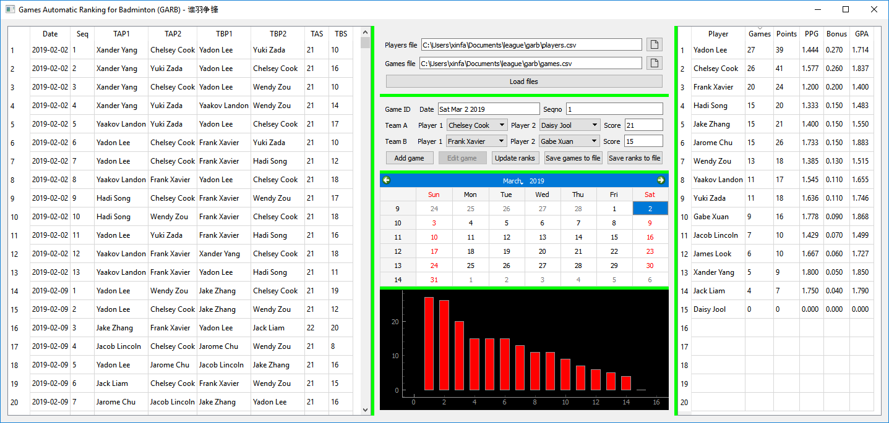

# Games Automatic Ranking for Badminton

Games Automatic Ranking for Badminton (GARB) is an application for our
badminton league to saving scores of games and ranking players' performance.

Before GARB, we were using Excel spreadsheet which looks like the snapshot
below. Obviously GARB has advantages in 1) more efficient when we need to
count rows and columns, and 2) less prone to human error.

## Developer

* Xinfa Joseph Zhu  <xinfazhu@gmail.com>

## Dependencies

* PyQt
* Pandas
* NumPy
* QtAwesome

## Installation

* Download the package, `$ python main.py`

* TODO To install system-wide from source distribution:
    `$ python setup.py install`

* TODO To install using a package management system:
    `pip install garb`
    `conda install garb`
